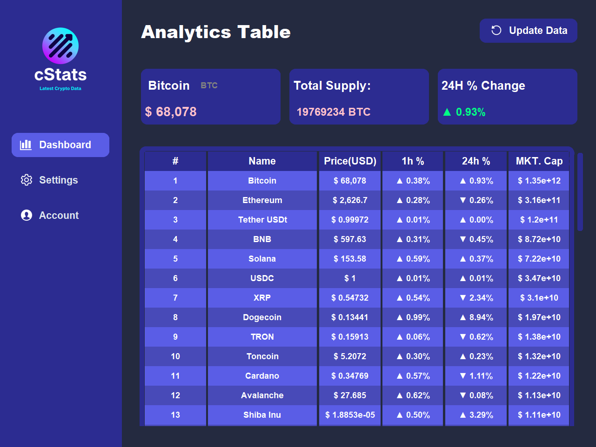
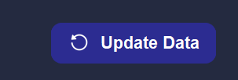

# CStats Crypto Tracker Tkinter App Python
CStats is a cryptocurrency tracking application that pulls data from the CoinMarketCap API, processes it, and displays key information 
about the top cryptocurrencies in a user-friendly graphical interface (GUI). It is built using Python with the `customtkinter` library 
to enhance the visual experience and includes features like real-time updates and interactive tables.

## Features
- **Cryptocurrency Data Tracking**: Pulls real-time data from the CoinMarketCap API, including cryptocurrency name, price, percent changes (1-hour, 24-hour), market capitalization, and total supply. Saves to a `crypto.json` file.

---

- **Interactive GUI**: The app uses `customtkinter` to provide a visually appealing interface. Users can explore detailed information about each cryptocurrency listed by clicking on a coin in the main table -> (Detail of crypto will be displayed at the top 3 boxes)

---

- **Data Rate Limiting**: To avoid excessive API calls, the app only pulls data every 2 hours. If an update is attempted before this, the user is prompted to try again later. `NOTE` you can change this by changing the value in `check_last_pulled_and_pull` function as shown below:

```python
if (time_now - last_pull_time) >= timedelta(hours=2):
# Change it to any value but suggestion is to have it set to more than 1 hour if you CoinMarketCap acount is free
```

---

- **Table Display**: Cryptocurrency data is presented in a clean, sortable table format with hover effects and color indicators for price trends. **A Picture of what it looks like below**




---

- **Update Data**: Press the update data button to update the data and pull from API. Watch terminal for API call limit errors or any other API errors (wont pull from API if there is an error).



---

- **Error Handling**: The app includes robust error handling for API calls, including network issues, timeouts, and rate limits watch for errors in terminal while trying to update the data via the update button in the customtkinter app.

| Error Code | Description                                                                 |
|------------|-----------------------------------------------------------------------------|
| 0          | Success - Data was successfully pulled from the API and saved to the file.  |
| 1          | API Error - The API responded with an error.                                |
| 2          | Network Error - Could not reach the API due to a network issue (e.g. connection error, timeout).
| 4          | API Hourly Pull Exceeded - You attempted to pull data more than once in the past 2 hours.


---

- **Customizable API Parameters**: Users can change the currency (default: USD) and the number of cryptocurrencies to display (default: 50) by modifying the API request parameters in `api_request.py` in the `api_runner` function.

```python
parameters = {
        'start': '1',     # Start at the first cryptocurrency at this rank
        'limit': '50',    # Limit to top 50 cryptocurrencies (NOTE YOU CAN CHANGE THIS VALUE BUT BE AWARE OF PULL CREDITS)
        'convert': 'USD'  # Convert prices to USD (NOTE YOU CAN CHANGE THE CURRENCY)
    }
# Change the currency, limit, or start (look at CoinMarketCap API Documentation to see what currencies are available)
```
---

## Installation
### Prerequisites

- Python 3.x
- The following Python libraries:
  - `customtkinter`
  - `requests`
  - `Pillow`
  - `json`
  - `os`
  - `json`
  - `winreg` if on windows

You can install these dependencies using `pip`:

```bash
pip install customtkinter requests Pillow
```

### Setup

1. **API Key Setup**: CStats uses an API key from [CoinMarketCap](https://pro.coinmarketcap.com/). The current key in the project belongs to Matin Iravani and you are welcome to use it. However, you can also create your own key by following these steps:

   - Go to [CoinMarketCap](https://pro.coinmarketcap.com/signup/).
   - Create a free account by signing up.
   - Once signed in, navigate to the "API" section in your dashboard.
   - Generate a new API key (make sure to copy it).

2. **Insert the API Key**: If you choose to use your own key, add it to the `api_request.py` file in the headers section:
   ```python
   headers = {
       'Accepts': 'application/json',
       'X-CMC_PRO_API_KEY': 'your-api-key-here',  # Replace 'your-api-key-here' with your actual API key
   }
   ```

4. **Modifying API Parameters**: 
   You can adjust the following parameters in `api_request.py`:
   - **Currency**: The API is set to fetch data in USD by default, but you can modify the currency by changing the `convert` parameter:
     ```python
     'convert': 'USD'  # Change 'USD' to any other currency symbol (e.g., 'EUR', 'BTC')
     ```
   - **Number of Cryptocurrencies**: By default, the app fetches the top 50 cryptocurrencies. You can adjust this by modifying the `limit` parameter:
     ```python
     'limit': '50'  # Change '50' to the number of cryptocurrencies you want to display
     ```

5. Run the main application:
   ```bash
   python main.py
   ```

---

## Functions Breakdown

### `formating.py`
- **`format_price(price: float) -> str`**: 
  Formats the price of a cryptocurrency into a string with a dollar sign and comma separation for better readability.

- **`format_percent_change(percent_change: float) -> str`**: 
  Adds an arrow (`▲` or `▼`) based on whether the percentage change is positive or negative.

- **`format_market_cap(market_cap: float) -> str`**: 
  Formats the market capitalization value into a readable string with appropriate separators.

- **`format_total_supply(total_supply: float, short_name: str) -> str`**: 
  Formats the total supply of a cryptocurrency with its respective short symbol.

- **`clear_frame(frame)`**: 
  Clears all widgets in a specified tkinter frame.

- **`process_crypto_data(data: list, table_data: list) -> list`**: 
  Processes raw cryptocurrency data and appends it to the table data for display.

### `main.py`
- **`update_data(file_path: str) -> None`**: 
  Reads cryptocurrency data from the JSON file, processes it, and updates the UI table.

- **`update_table_ui(table_data: list) -> None`**: 
  Destroys the old table and creates a new one with updated cryptocurrency data.

- **`print_row(row: dict, table_data: list) -> None`**: 
  Prints selected cryptocurrency row data from the table.

- **`update_crypto_info(row_data: list[str]) -> None`**: 
  Updates the displayed cryptocurrency information based on the selected row.

### `time_stamp.py`
- **`save_timestamp()`**: 
  Saves the current timestamp to either the Windows registry or a JSON file based on the operating system.

- **`read_timestamp()`**: 
  Reads the saved timestamp from the Windows registry or JSON file.

### `api_request.py`
- **`pull_from_api(file_path: str, active_message: list[str]) -> None`**: 
  Pulls cryptocurrency data from the CoinMarketCap API and saves it to a local JSON file.

---

## Usage

Once you run the application, the GUI will display the top cryptocurrencies in a visually appealing table. You can view details like:

- **Name and Price**: The current price of the cryptocurrency in USD.
- **1-Hour and 24-Hour Percent Changes**: The price change in the past hour and 24 hours, with visual indicators (▲ for increases and ▼ for decreases).
- **Market Capitalization**: The total market value of the circulating supply of the cryptocurrency.
- **Total Supply**: The total supply of the cryptocurrency available in the market.

---

## Contributing

Feel free to submit issues, fork the repository, and create pull requests. Contributions are welcome!

---

## License

This project is licensed under the terms of the [LICENSE](LICENSE).

---

## API Credits

The cryptocurrency data is provided by the [CoinMarketCap API](https://coinmarketcap.com/api/pricing/). Click Free Basic Plan and you will get access to your own API key. Also for full documentation of coinmarketcap go to [CoinMarketCap Documentation](https://coinmarketcap.com/api/documentation/v1/)

---

## Future Improvements

- Add sorting and filtering capabilities to the table.
- Implement a notification system for significant price changes.
- Integrate more detailed charts to show historical trends.
